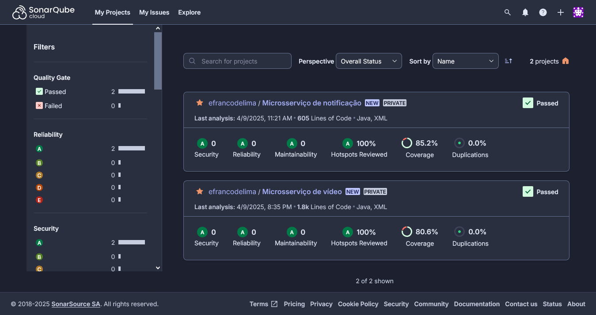
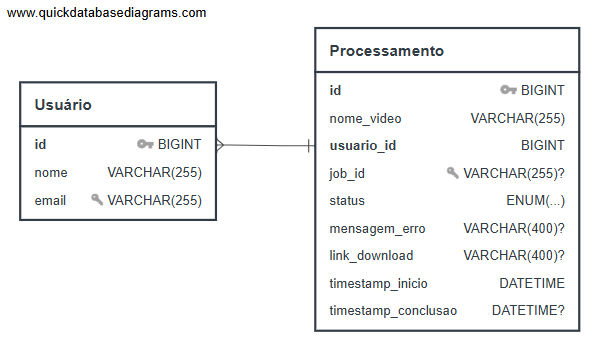
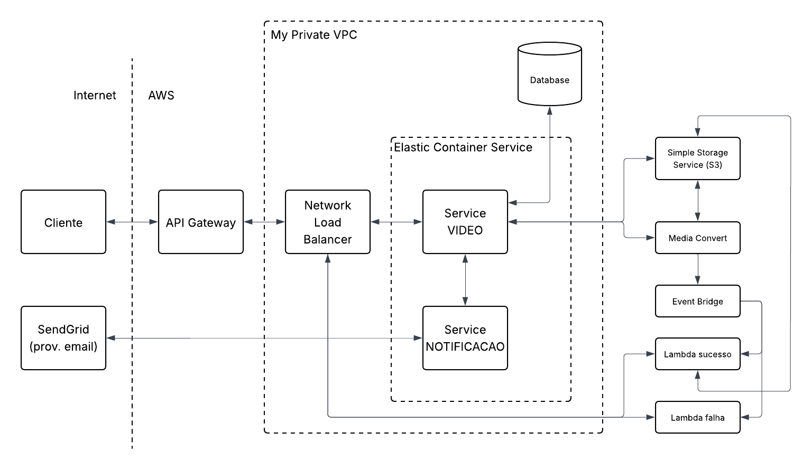

# Tech Challenge - Fase 5

Projeto realizado como atividade avaliativa do curso de **Software Architecture - Pós-Tech - FIAP**.

Link do projeto no GitHub:

- Microsserviço de vídeo: https://github.com/efrancodelima/f5-processamento
- Microsserviço de notificação: https://github.com/efrancodelima/f5-notificacao
- Lambda AWS de sucesso: https://github.com/efrancodelima/f5-lambda-sucesso
- Lambda AWS de falha: https://github.com/efrancodelima/f5-lambda-falha
- Projeto front-end: https://github.com/efrancodelima/f5-estatico

Link do vídeo com a apresentação do projeto:

- PENDENTE

# Índice

- [Objetivos](#1-objetivos)
- [Requisitos](#2-requisitos)
  - [Processamento assíncrono](#21-processamento-assíncrono)
  - [Listagem dos vídeos](#22-listagem-dos-vídeos)
  - [Autenticação](#23-autenticação)
  - [Persistência dos dados](#24-persistência-dos-dados)
  - [Notificações](#25-notificações)
  - [Balanceamento de carga](#26-balanceamento-de-carga)
  - [Escalabilidade](#27-escalabilidade)
  - [Repositórios](#28-repositórios)
  - [Qualidade do software](#29-qualidade-do-software)
  - [Pipeline](#210-pipeline)
- [Banco de dados](#3-banco-de-dados)
  - [Modelo lógico](#31-modelo-lógico)
  - [Script SQL](#32-script-sql)
- [Arquitetura do sistema](#4-arquitetura-do-sistema)

## 1. Objetivos

Desenvolver uma aplicação capaz de processar imagens a partir de um vídeo, ou seja, capturar frames do vídeo em um intervalo regular de tempo. A aplicação deve utilizar os conceitos apresentados no curso, conforme especificado no Tech Challenge.

Mais detalhes sobre o projeto serão mostrados na parte de requisitos.

## 2. Requisitos

### 2.1 Processamento assíncrono

"A nova versão do sistema deve processar mais de um vídeo ao mesmo tempo."

O microsserviço de processamento possui um endpoint para receber um ou mais vídeos.

Colocamos um limite de 300 MB por upload, que pode ser alterado conforme a necessidade. O cliente pode escolher se deseja enviar vários vídeos em uma requisição só ou em requisições separadas, desde que respeite o limite de upload. Em qualquer caso, os vídeos serão processados simultaneamente, em diferentes threads.

Se vier um vídeo por requisição e houver várias requisições simultâneas, o processamento dos vídeos também será simultâneo, pois esse já é o comportamento padrão de um microsserviço Java/Spring: cada requisição roda em uma thread separada.

Se vierem vários vídeos em uma requisição só, o sistema irá encaminhar cada vídeo para uma thread diferente, usando recursos de assincronismo.

### 2.2 Listagem dos vídeos

"O fluxo deve ter uma listagem de status dos vídeos de um usuário."

Esse ponto criou uma certa dúvida se o fluxo citado no documento se referia ao uso de WebFlux ou SSE, mas em contato com os professores pelo Discord foi orientado que se tratava apenas de uma lista.

Inicialmente, pensamos em criar um endpoint que atualizaria os status dos vídeos de tempos em tempos para o cliente (usando webflux). Mas depois achei melhor criar um endpoint simples que retorna a listagem e deixar nas mãos do cliente o controle sobre a consulta. No caso, o cliente pode ser uma aplicação front end e ela decide quando e em qual intervalo de tempo ela quer consultar a listagem. Ela decide se quer consultar apenas uma vez ou se prefere ir atualizando os status, ela decide quando parar, etc.

O front end não é necessário para a entrega do Tech Challenge, mas nós criamos um projeto bem simples em Angular, só para facilitar a apresentação da aplicação. Assim não será necessário ficar inserindo token de autenticação manualmente na requisição.

### 2.3 Autenticação

"O Sistema deve ser protegido por usuário e senha."

FORMA DE AUTENTICAÇÃO

Para poder usar o sistema, o usuário deve se autenticar usando sua conta Google.
Sem se autenticar, o usuário não consegue enviar vídeos, listar os vídeos enviados e visualizar os status de cada um.
Obviamente, uma vez autenticado, ele tem acesso apenas aos seus próprios vídeos.

Por que escolhi usar a conta Google como forma de autenticação?
Por dois motivos:
- Usar uma conta já existente é mais prático e oferece uma experiência mais agradável ao usuário, que não vai precisar preencher um novo cadastro;
- Hoje em dia a maioria dos usuários web possui uma conta Google (em 2024 o Google tinha mais de 2 bilhões de usuários ativos);
- Poderia ter usado o Cognito, mas já usei ele no Tech Challenge da fase 3, então não agregaria nenhum aprendizado novo (embora também fosse uma boa solução).

GERADOR DE TOKEN

O token de autenticação é emitido usando o Firebase e tem prazo de validade de 1 hora (podendo ser renovado pela aplicação se o usuário continuar ativo).

Por que escolhi o Firebase para gerar o token?
O firebase é uma ferramenta interessante porque oferece várias opções de login, permitindo expandir as opções de entrada do sistema no futuro. Exemplos de opções disponíveis: email e senha, número de telefone, Apple sign-in e provedores de identidade federados, tais como o Google, Facebook, Twitter, GitHub, entre outros.

VALIDAÇÃO DO TOKEN NA APLICAÇÃO

Os microsserviços da aplicação rodam na rede privada da AWS, não sendo diretamente acessíveis pela internet. Os endpoints que o usuário necessita acessar (video/upload e video/listar) são expostos por meio de um API Gateway.

Esses endpoints possuem um filtro de autenticação. O filtro, na hora de validar o token JWT, considera não apenas o conteúdo do token, mas o emissor também (que é a nossa aplicação cadastrada no Firebase). Isso corrobora na segurança do sistema.

### 2.4 Persistência dos dados

"O sistema deve persistir os dados."

O sistema persiste os dados de uso do usuário e o arquivo zip gerado.

Com relação à parte multimídia, decidimos não persistir o vídeo em si, o que poderia impactar no custo de armazenamento. O vídeo é descartado após o processamento, apenas o resultado final, o arquivo zip para download é persistido.

Com relação aos dados de utilização do usuário, persistimos:
- nome e email do usuário;
- nome do vídeo recebido;
- timestamp do recebimento do vídeo;
- status do vídeo;
- timestamp da conclusão;
- mensagem de erro, se houver;
- link para download do arquivo zip.

Isso tudo será detalhado melhor mais à frente na parte de banco de dados.

### 2.5 Notificações

"Em caso de erro um usuário pode ser notificado (email ou um outro meio de comunicação)."

O microsserviço de notificação foi criado só para fazer isso.

Quando o usuário envia um vídeo para processar, ele recebe uma resposta 204 assim que o upload do vídeo é concluído. A aplicação não fica esperando o vídeo terminar de processar para depois responder o usuário (o que seria uma experiência bem ruim).

Quando o vídeo termina de processar, um email é enviado para o usuário notificando a finalização com sucesso ou falha, conforme o caso. Se for sucesso, o link para download do arquivo zip contendo as imagens vai junto no e-mail. Se houver falha, o motivo da falha é informado no e-mail (pode ser um tipo de arquivo não compatível com o serviço, por exemplo).

### 2.6 Balanceamento de carga

"Em caso de picos o sistema não deve perder uma requisição."

O sistema roda no Elastic Container Service, um orquestrador de containeres próprio da AWS, e possui um load balancer associado. Os services do ECS possuem um número mínimo e máximo de tasks, o que garante a escalabilidade do sistema. Naturalmente, esses números devem ser ajustados e redimensionados conforme a demanda da aplicação.

Além disso, um ponto importante é que o processamento do vídeo é feito pelo Media Convert da AWS. Esse processamento demanda bastante CPU e memória, então terceirizamos essa tarefa para não sobrecarregar a aplicação. A aplicação ficou responsável apenas pelas tarefas mais simples: receber o vídeo, salvá-lo no bucket S3, criar o job no Media Convert, gerar o link presigned quando o processo terminar, entre outras coisas.

### 2.7 Escalabilidade

"O sistema deve estar em uma arquitetura que o permita ser escalado."

Ok, o sistema roda no Elastic Container Service e utiliza o banco de dados Aurora. Ambos pertencem ao ecossistema da AWS e ambos são escaláveis. No caso do banco de dados, a escalabilidade é automática, gerenciada pela própria AWS. No caso do ECS, podemos configurar o número mínimo e máximo de tasks, bem como as regras de escalabilidade.

### 2.8 Repositórios

"O projeto deve ser versionado no Github."

Ok, os links para os repositórios se encontram no início deste documento. Os repositórios têm a branch main protegida e só aceitam merge por meio de pull request.

### 2.9 Qualidade do software

"O projeto deve ter testes que garantam a sua qualidade."

Cada microsserviço possui cobertura de testes mínima de 80% e análise de issues/vulnerabilidades pelo Sonar.

Na pipeline, após a análise do Sonar, tem um step para validar da qualidade do código. Essa validação é feita com um script bash que pega os dados do Sonar Cloud (utilizando a API Web que ele disponibiliza) e verifica se os valores estão ok.

O script confere e imprime os dados, item por item, no log da pipeline:
- coverage analysis (tests errors, testes failures, coverage and line coverage);
- security analysis (vulnerabilities, hotspots and rating);
- reliability analysis (bugs and rating);
- maintainability analysis (code smells and rating);
- quality gate (status).

Abaixo segue a evidência dos testes:



### 2.10 Pipeline

"CI/CD da aplicação."

A pipeline segue o padrão dos projetos anteriores: ela valida a qualidade do código (conforme descrito no item anterior) e, se a qualidade estiver ok, faz o build da imagem docker, faz o push no ECR e o deploy no ECS. Se der qualquer erro, a pipeline é interrompida.

Links para o job completo da pipeline:
- Microsserviço de vídeo: https://github.com/efrancodelima/f5-processamento/actions/runs/14322269037/job/40141338166
- Microsserviço de notificação: https://github.com/efrancodelima/f5-notificacao/actions/runs/14320065155/job/40135129961
- Lambda de sucesso: https://github.com/efrancodelima/f5-lambda-sucesso/actions/runs/14020601602/job/39252034654
- Lambda de falha:  https://github.com/efrancodelima/f5-lambda-falha/actions/runs/14020589569/job/39252008176

## 3 Banco de dados

O banco de dados escolhido para a aplicação foi o Aurora, um banco de dados relacional da AWS.

### 3.1 Modelo lógico

O diagrama abaixo foi feito usando a ferramenta Quick Database Diagrams. O sinal de interrogação nos tipos dos campos indicam que o campo pode ser nulo. As chaves indicam chave primária (maior) e chave única (menor). A chave estrangeira é indicada pelo relacionamento.

O modelo construído visa armazenar somente as informações necessárias para a proposta atual. Conforme o sistema for crescendo, talvez seja interessante guardar mais dados do usuário, ter uma entidade só para o vídeo, outra para pagamento, outra para o histórico do processamento (guardando o registro de cada mudança de status), etc. Mas, no momento, o modelo porposto atende o que foi pedido.



### 3.2 Script SQL

O script SQL do esquema do banco de dados segue abaixo:

```SQL
CREATE TABLE usuario (
    id BIGINT AUTO_INCREMENT PRIMARY KEY,
    nome VARCHAR(255) NOT NULL,
    email VARCHAR(255) NOT NULL UNIQUE
);

CREATE TABLE processamento (
    id BIGINT AUTO_INCREMENT PRIMARY KEY,
    nome_video VARCHAR(255) NOT NULL,
    usuario_id BIGINT NOT NULL,
    job_id VARCHAR(255),
    status ENUM('RECEBIDO', 'PROCESSANDO', 'CONCLUIDO', 'ERRO') NOT NULL,
    mensagem_erro VARCHAR(400),
    link_download VARCHAR(400),
    timestamp_inicio DATETIME NOT NULL,
    timestamp_conclusao DATETIME,
    CONSTRAINT fk_usuario FOREIGN KEY (usuario_id) REFERENCES usuario(id)
);
```

## 4 Arquitetura do sistema

Abaixo segue o diagrama da arquitetura do sistema e, em seguida, uma breve explanação sobre ele.



A aplicação é dividida em dois microsserviços:
 - o microsserviço de vídeo, responsável por gerenciar o processamento do vídeo. Ele apenas gerencia o processamento, mas não processa nada (quem faz isso é o Media Convert);
 - e o microsserviço de notificação, responsável por notificar o usuário quando o vídeo termina de processar. Ele usa o SendGrid como provedor para envio de e-mails.

A aplicação roda em uma rede privada, não sendo acessível pela internet sem passar pelo API Gateway. O API Gateway expõe apenas os endpoints que podem ser consumidos pelo cliente e oculta/bloqueia os webhooks que são usados pelas lambdas.

O cliente (que pode ser o front end) envia a requisição para a aplicação. A aplicação responde ao cliente com um status code 204 (No Content) assim que recebe a requisição completa (contendo a lista de vídeos).

Após isso, cada vídeo da requisição continua em uma thread separada. Cada thread salva o vídeo recebido em um bucket do S3 e cria o job no Media Convert. A aplicação vai atualizando a situação do vídeo no database conforme os eventos vão ocorrendo: recebido, em processamento, concluído ou com erro.

Quando o Media Convert termina o seu trabalho, o Event Bridge aciona a lambda de sucesso ou falha, conforme o caso. Se o status do job muda para concluído, um evento é acionado, se muda para erro, é outro evento e outra lambda.

A lambda de sucesso irá acessar o S3 para ler e gravar dados, pois é ela quem compacta as imagens em um arquivo zip e apaga os arquivos que não serão mais necessários (o vídeo e as imagens avulsas fora do zip). No final ela chama um webhook da aplicação para dar continuidade.

A aplicação irá então gerar o link presigned e enviar um e-mail para o usuário com o link para download das imagens compactadas. Esse link presigned é um link com prazo de validade gerado pela AWS que permite compartilhar arquivos do S3 com outras pessoas.

A lambda de falha aciona o webhook da aplicação (sempre passando pelo load balancer) para comunicar a falha. A aplicação registra o motivo da falha no database e envia um e-mail informando o usuário.

Um ponto importante no trabalho das lambdas é que a comunicação delas com a aplicação é assíncrona. Considerando que as lambdas são cobradas por tempo de execução, a aplicação responde com um 204 assim que o webhook é acionado.

Outro ponto importante é que a tarefa de compactar as imagens está sendo feita fora da nossa aplicação. 
Compactar imagens é um trabalho que pode consumir muita CPU e memória e, dependendo do caso, isso poderia escalar demais a nossa aplicação, aumentando os custos ou até mesmo causando indisponibilidade (caso o máximo de tasks seja atingido). A lambda possui escalabilidade automática (gerenciada pela AWS), então é um ponto a menos para nos preocuparmos.